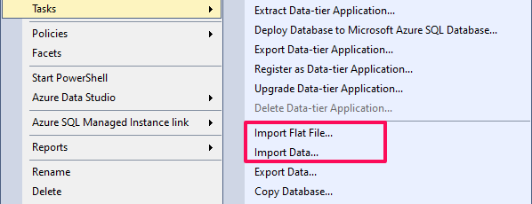
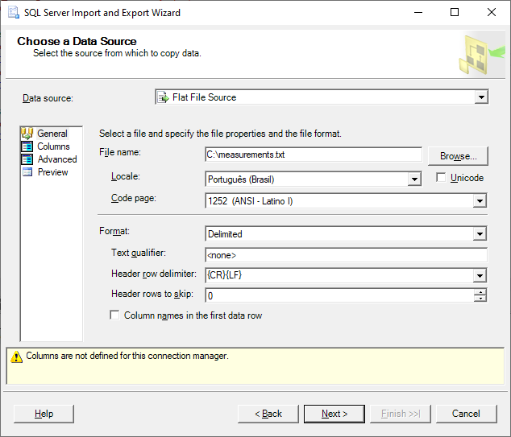
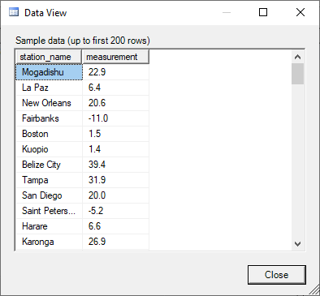

# Carregando e calculando 1 bilhão de linhas no SQL Server

Inspirado no desafio conhecido como "The One Billion Row Challenge". Meu propósito desse projeto é mostrar, de forma prática, como é possível carregar uma quantidade grande de dados (1 bilhão de linhas) no SQL Server, com segurança e foco em performance.

A ideia aqui é explorar e testar diferentes estratégias de carga e depois mostrar como o banco se comporta ao fazer consultas e cálculos pesados sobre esses dados. Tudo isso com uma visão voltada para o uso real em ambientes de produção, sempre buscando boas práticas.

## Objetivos
- Testar diferentes métodos de importação de dados.
- Realizar medições de desempenho.
- Apresentar boas práticas para lidar com grande carga de dados.


## Tecnologias utilizadas nesse projeto
- Microsoft SQL Server 2022 - Developer Edition (64-bit)
- SQL Server Management Studio (SSMS) - 20.2.37.0
- Sistema Operacional: Windows 10 Pro

## Índice

[Criando o arquivo base de 1 bilhão de linhas](##criando-o-arquivo-base-com-1-bilhao-de-linhas)

## Criando um Database para realizar os testes

Foi utilizado o script: [create_database.sql](./queries/create_database.sql)

```
CREATE DATABASE ONE_BILLION_CHALLENGE;
GO
```

## Criando o arquivo base de 1 bilhão de linhas

Para gerar o arquivo de dados que será usado nos testes, utilizei o repositório original do desafio. Você pode acessar o projeto [clicando aqui](https://github.com/gunnarmorling/1brc).

Basta seguir os passos do repositorio. O projeto é feito em Java, então é necessário ter o Java instalado na sua máquina para conseguir executar os passos.

O processo irá gerar um arquivo em formato .txt com aproximadamente 12 GB, e pode levar cerca de 10 minutos (esse foi o tempo gasto no meu ambiente).

Exemplo do dados do arquivo gerado:

```
Mogadishu;22.9
La Paz;6.4
New Orleans;20.6
Fairbanks;-11.0
Boston;1.5
Kuopio;1.4
Belize City;39.4
Tampa;31.9
San Diego;20.0
Saint Petersburg;-5.2
```

"*Mogadishu*" seria o nome de uma estação e "*22.9*" sua temperatura.

## Usando o Assistente de Importação e Exportação (Import and Export Wizard)



Existem dois tipos de importação de usando o assistente do SSMS, ***Import Flat File*** e ***Import Data***.

### Usando o Import Flat File

Seria a maneira mais simples e direta de realizar a importação de um arquivo simples no formato ``.csv`` ou ``.txt``.

O processo é basicamente:

Selecionar o arquivo a ser importado → definir o nome da tabela → configurar o schema → concluir.


Porém, ao tentar utilizar esse assistente com o arquivo gerado (com cerca de 12 GB), recebi a seguinte mensagem de erro:


Provavelmente, o tamanho do arquivo é tão grande que o assistente não consegue alocar tudo na memória e isso acaba causando a falha na importação.

Esse assistente é bastante prático para arquivos pequenos ou médios. No entanto, para volumes maiores (como no caso desse projeto), ele não é recomendado.

### Usando o Import Data

O Import Data é um assistente de importação mais robusto, permitindo a escolha entre diversos tipos de fontes de dados.

Foi escolhido o formato *Flat File Source* como fonte de dados.



Ele oferece mais controle sobre o processo, como:

- Definir o delimitador do arquivo (vírgula, ponto e vírgula, etc.).
- Renomear nomes das colunas e os tipos da tabela de destino.
- Visualizar um preview de como os dados ficarão após a importação.

O destino dos dados será no nosso database ONE_BILLION_CHALLENGE.


Podemos ter o preview de como pode ficar a tabela após a importação:



Podemos executar a importação diretamente e/ou salvar um pacote SSIS para reaproveitar ou automatizar esse processo no futuro.


É possível realizar a importação diretamente, mas irei utilizar a opção de salvar o arquivo SSIS Package para poder fazer as métricas de duração da importação.


Basta finalizar para que o arquivo seja criado.


Para executar o pacote SSIS, vamos utilizar o utilitário [dtexec](https://learn.microsoft.com/pt-br/sql/integration-services/packages/dtexec-utility?view=sql-server-ver16).

Utilizei o comando abaixo:

```
dtexec /F "C:\import-1billion-rows.dtsx" /REP V | Tee-Object -FilePath log.txt
```

- *dtexec*: Executa o pacote SSIS a partir da linha de comando.
- */F*: Informa que você está executando um pacote salvo como um arquivo .dtsx.
- */REP*: Define o nível de log/reporting que será gerado.
- *V (Verbose)*: Especifica que o log deve ser o mais detalhado possível, incluindo todos os eventos, mensagens de erro, progresso, avisos e tempo de execução.
- *Tee-Object*: Este comando do PowerShell permite que você exiba a saída de um comando ao mesmo tempo em que a salva em um arquivo.
- *-FilePath log.txt:* Define o caminho e o nome do arquivo onde a saída será salva. O log será gravado no arquivo log.txt.

No final do processo será mostrado uma mensagem parecida com essa:

```
DTExec: a execução do pacote retornou DTSER_SUCCESS (0).
Início: 15:04:12
Conclusão: 15:50:36
Tempo decorrido:  2784.19 segundos
```

Foi preciso um pouco mais de **46 minutos** para importar todas as linhas.

Essa ferramenta é mais adequada para arquivos grandes, embora ainda não seja a opção mais performática quando lidamos com bilhões de linhas. Mesmo assim, é útil para testes, análises exploratórias ou importações estruturadas.