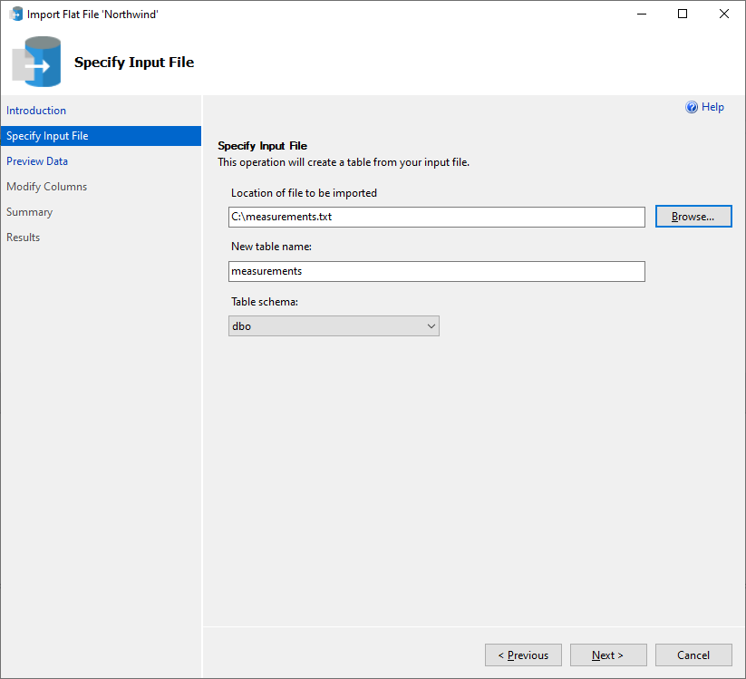
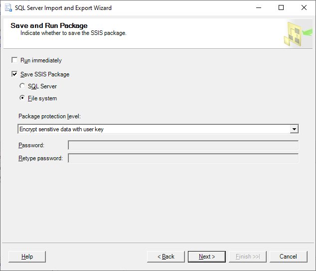
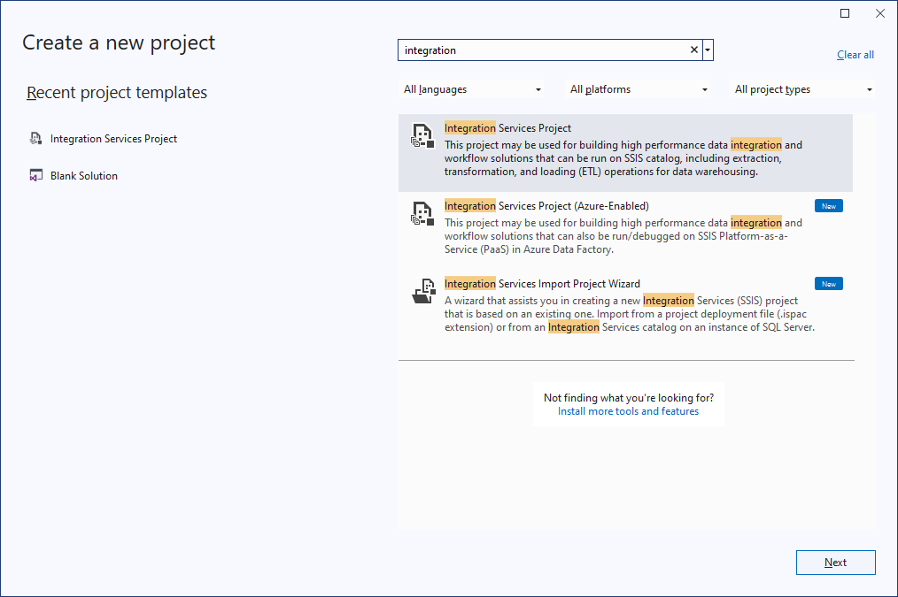
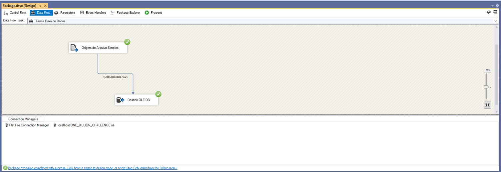
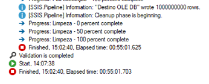
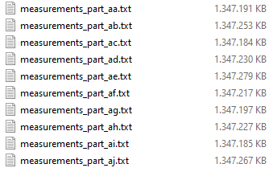

# Carregando e calculando 1 bilhão de linhas no SQL Server

Inspirado no desafio conhecido como "The One Billion Row Challenge". Meu propósito desse projeto é mostrar, de forma prática, como é possível carregar uma quantidade grande de dados (1 bilhão de linhas) no SQL Server, com segurança e foco em performance.

A ideia aqui é explorar e testar diferentes estratégias de carga e depois mostrar como o banco se comporta ao fazer consultas e cálculos pesados sobre esses dados. Tudo isso com uma visão voltada para o uso real em ambientes de produção, sempre buscando boas práticas.

## Objetivos
- Testar diferentes métodos de importação de dados.
- Realizar medições de desempenho.
- Apresentar boas práticas para lidar com grande carga de dados.


## Tecnologias utilizadas nesse projeto
- Microsoft SQL Server 2022 - Developer Edition (64-bit)
- SQL Server Management Studio (SSMS) - 20.2.37.0
- Sistema Operacional: Windows 10 Pro

# Índice

- [Criando um database para realizar os testes](#criando-um-database-para-realizar-os-testes)
- [Criando o arquivo base de 1 bilhão de linhas](#criando-o-arquivo-base-de-1-bilhão-de-linhas)
- [Usando o Assistente de Importação e Exportação (Import and Export Wizard)](#usando-o-assistente-de-importação-e-exportação-import-and-export-wizard)
  - [Usando o Import Flat File](#usando-o-import-flat-file)
  - [Usando o Import Data](#usando-o-import-data)
- [Utilizando o utilitário bcp](#utilizando-o-utilitário-bcp)
- [Importando utilizando o Integration Services (SSIS)](#importando-utilizando-o-integration-services-ssis)
- [Utilizando o BULK INSERT](#utilizando-o-bulk-insert)
  - [BULK INSERT com arquivo único](#bulk-insert-com-arquivo-único)
  - [BULK INSERT com múltiplos arquivos](#bulk-insert-com-múltiplos-arquivos)

# Criando um database para realizar os testes

Criado database ONE_BILLION_CHALLENGE:

```sql
CREATE DATABASE ONE_BILLION_CHALLENGE;
GO
```

# Criando o arquivo base de 1 bilhão de linhas

Para gerar o arquivo de dados que será usado nos testes, utilizei o repositório original do desafio. Você pode acessar o projeto [clicando aqui](https://github.com/gunnarmorling/1brc).

Basta seguir os passos do repositorio. O projeto é feito em Java, então é necessário ter o Java instalado na sua máquina para conseguir executar os passos.

O processo irá gerar um arquivo em formato .txt com aproximadamente 12 GB, e pode levar cerca de 10 minutos (esse foi o tempo gasto no meu ambiente).

Exemplo do dados do arquivo gerado:

> Mogadishu;22.9<br>
> La Paz;6.4<br>
> New Orleans;20.6<br>
> Fairbanks;-11.0<br>
> Boston;1.5<br>
> Kuopio;1.4<br>
> Belize City;39.4<br>
> Tampa;31.9<br>
> San Diego;20.0<br>
> Saint Petersburg;-5.2<br>

"*Mogadishu*" seria o nome de uma estação e "*22.9*" sua temperatura.

# Usando o Assistente de Importação e Exportação (Import and Export Wizard)


Existem dois tipos de importação de usando o assistente do SSMS, ***Import Flat File*** e ***Import Data***.

## Usando o Import Flat File

Seria a maneira mais simples e direta de realizar a importação de um arquivo simples no formato ``.csv`` ou ``.txt``.

O processo é basicamente:

Selecionar o arquivo a ser importado → definir o nome da tabela → configurar o schema → concluir.



Porém, ao tentar utilizar esse assistente com o arquivo gerado (com cerca de 12 GB), recebi a seguinte mensagem de erro:


Provavelmente, o tamanho do arquivo é tão grande que o assistente não consegue alocar tudo na memória e isso acaba causando a falha na importação.

Esse assistente é bastante prático para arquivos pequenos ou médios. No entanto, para volumes maiores (como no caso desse projeto), ele não é recomendado.

## Usando o Import Data

O Import Data é um assistente de importação mais robusto, permitindo a escolha entre diversos tipos de fontes de dados.

Foi escolhido o formato *Flat File Source* como fonte de dados.


Ele oferece mais controle sobre o processo, como:

- Definir o delimitador do arquivo (vírgula, ponto e vírgula, etc.).
- Renomear nomes das colunas e os tipos da tabela de destino.
- Visualizar um preview de como os dados ficarão após a importação.

O destino dos dados será no nosso database ONE_BILLION_CHALLENGE.


Podemos ter o preview de como pode ficar a tabela após a importação:


Podemos executar a importação diretamente e/ou salvar um pacote SSIS para reaproveitar ou automatizar esse processo no futuro.



É possível realizar a importação diretamente, mas irei utilizar a opção de salvar o arquivo SSIS Package para poder fazer as métricas de duração da importação.


Basta finalizar para que o arquivo seja criado.


Para executar o pacote SSIS, vamos utilizar o utilitário [dtexec](https://learn.microsoft.com/pt-br/sql/integration-services/packages/dtexec-utility?view=sql-server-ver16).

Utilizei o comando abaixo:

```ps1
dtexec /F "C:\import-1billion-rows.dtsx" /REP V | Tee-Object -FilePath log.txt
```

- *dtexec*: Executa o pacote SSIS a partir da linha de comando.
- */F*: Informa que você está executando um pacote salvo como um arquivo .dtsx.
- */REP*: Define o nível de log/reporting que será gerado.
- *V (Verbose)*: Especifica que o log deve ser o mais detalhado possível, incluindo todos os eventos, mensagens de erro, progresso, avisos e tempo de execução.
- *Tee-Object*: Este comando do PowerShell permite que você exiba a saída de um comando ao mesmo tempo em que a salva em um arquivo.
- *-FilePath log.txt:* Define o caminho e o nome do arquivo onde a saída será salva. O log será gravado no arquivo log.txt.

No final do processo será mostrado uma mensagem parecida com essa:

> DTExec: a execução do pacote retornou DTSER_SUCCESS (0).<br>
> Início: 15:04:12<br>
> Conclusão: 15:50:36<br>
> Tempo decorrido:  2784.19 segundos<br>

Foi preciso um pouco mais de **46 minutos** para importar todas as linhas.

Essa ferramenta é mais adequada para arquivos grandes, embora ainda não seja a opção mais performática quando lidamos com bilhões de linhas. Mesmo assim, é útil para testes, análises exploratórias ou importações estruturadas.

# Utilizando o utilitário bcp

BCP (Bulk Copy Program) é uma ferramenta de linha de comando do SQL Server usada para importar ou exportar grandes volumes de dados de forma rápida entre arquivos e tabelas.

Pontos para o uso do BCP:

- Alta performance: Trabalha com grandes volumes de dados rapidamente.
- Leve e direto: Utilitário simples, sem necessidade de interface gráfica.
- Personalizável: Permite definir delimitadores, codificações, tamanho de lotes, arquivos de erro etc.

Para mais informações sobre o bcp, [clique aqui](https://learn.microsoft.com/pt-br/sql/relational-databases/import-export/import-and-export-bulk-data-by-using-the-bcp-utility-sql-server?view=sql-server-ver16).

Antes de carregar usando o bcp, precisamos criar uma tabela para onde será importado os dados:

```sql
USE ONE_BILLION_CHALLENGE;
GO

CREATE TABLE measurements_bcp
(
	station_name VARCHAR(100),
	temperature DECIMAL(9,2)
);
GO
```

Após alguns testes, esse foi o comando utilizado em meu ambiente:

```bat
bcp ONE_BILLION_CHALLENGE.dbo.measurements_bcp IN "C:\measurements.txt" ^
-S DESKTOP-DA9MA40 -U <seu-usuario> -P <sua-senha> ^
-C 65001 -c -t ";" -r "0x0a" -b 100000 ^
-e "C:\bcp_errors.txt" -a 65535 -m 1000 ^
```

- ``bcp``: chama a ferramenta Bulk Copy Program.
- ``ONE_BILLION_CHALLENGE.dbo.measurements_bcp``: nome do database e tabela de destino.
- ``IN``: indica que os dados estão sendo importados para o SQL Server.
- ``"C:\measurements.txt"``: caminho completo do arquivo com os dados.
- ``-S DESKTOP-DA9MA40``: nome do servidor ou instância do SQL Server, por exemplo o nome do meu host.
- ``-U <seu-usuario>``: usuário SQL Server (modo de autenticação SQL), por exemplo o SA.
- ``-P <sua-senha>``: senha do usuário.
- ``-C 65001``: define o uso da codificação UTF-8.
- ``-c``: formato de texto (caractere), não usa tipos fixos binários.
- ``-t ";"``: delimitador de colunas é ponto e vírgula (;).
- ``-r "0x0a"``: delimitador de linhas é 0x0a (newline = \n).
- ``-b 100000``: lote de 100.000 linhas por commit (melhora o desempenho).
- ``-e "C:\bcp_errors.txt"``: salva as linhas com erro nesse arquivo.
- ``-a 65535``: tamanho do buffer de pacote em bytes (ajusta desempenho).
- ``-m 1000``: permite até 1000 erros antes de interromper o processo.

Para executar, basta abrir o seu CMD e executar o comando.


Quando finalizar o processo, receberá uma mensagem parecida com essa:

> 1000000000 linhas copiadas.<br>
> Tamanho do pacote de rede (bytes): 32576<br>
> Tempo total do relógio (ms.)     : 2216078 Média : (451247.66 linhas /s.)<br>

O resultado nos mostra que precisou de aproximadamente **37 minutos** para a carga total dos dados, com uma taxa média de 451.247 linhas por segundo!

# Importando utilizando o Integration Services (SSIS)

SQL Server Integration Services (SSIS) é uma ferramenta da Microsoft para extração, transformação e carga de dados (ETL). Permite importar diversos tipos de arquivos e fonte de dados para tabelas SQL Server com validação, transformação e automação.

Pontos para o uso do SSIS:
- Interface gráfica: criação e visualização do fluxo ETL mais fácil.
- Alta performance: Projetado para grandes volumes de dados.
- ETL: Ferramenta com transformações nativas, sem necessidade de criação de código.
- Conectividade: Pode se conectar facilmente com outros bancos como Oracle e Mysql.

Caso não tenha instalado, é necessario possuir a extensão [SQL Server Data Tools](https://learn.microsoft.com/en-us/sql/ssdt/download-sql-server-data-tools-ssdt?view=sql-server-ver16&tabs=vs2022).

Não irei entrar em detalhes como realizei a criação do fluxo de importação, apenas criei um projeto de *Integration Services Projects*, com um fluxo simples de input de arquivo TXT para um destino OLE DB.

Criando o projeto:



Realizando o fluxo de processo:



Resultado do processo:



A importação usando o SSIS durou quase exatamente **55 minutos**.

Apesar de ter demorado mais tempo que os testes anteriores, o SSIS é uma ótima ferramenta para ETL utilizado em ambiente profissionais. Pela seu poder de controle maior no fluxo de processo, possuir transformações embutidas, monitoramento e logging dos trabalhos e de ser reutilizado em automações.

# Utilizando o BULK INSERT

O `BULK INSERT` é um comando do T-SQL. Usado para fazer importação de arquivos como TXT e CSV para uma tabela do SQL Server.

Pode ler mais sobre ele nessa documentação: [BULK INSERT (Transact-SQL)](https://learn.microsoft.com/pt-br/sql/t-sql/statements/bulk-insert-transact-sql?view=sql-server-ver16).

Pontos do BULK INSERT:

- Rápido: Pode importar milhões de linhas rapidamente.
- Simples: código T-SQL, pode ser usado em precisar de ferramentas externas.
- Controle: Pode fazer cargas em lotes.

## BULK INSERT com arquivo único

Utilizei o comando T-SQL abaixo para realizar a importação:

```sql
BULK INSERT measurements_bulk
FROM 'C:\measurements.txt'
WITH (
    FIELDTERMINATOR = ';',
    ROWTERMINATOR = '0x0a',
    TABLOCK,
    BATCHSIZE = 100000, 
    FIRSTROW = 1
);
```

Lembrando que é preciso criar a tabela `measurements_bulk` antes de realizar o BULK INSERT.


- ``FIELDTERMINATOR``: Define que os campos no arquivo estão separados por ; (ponto e vírgula).
- ``ROWTERMINATOR``: Define que cada linha termina com 0x0a, ou seja, Line Feed (\n, comum em arquivos Unix/Linux).
- ``TABLOCK``:	Aplica um bloqueio exclusivo na tabela durante a importação, o que acelera a performance em grandes volumes.
- ``BATCHSIZE``: Processa a importação em blocos de 100.000 linhas. Ajuda no desempenho e no controle de erros.
- ``FIRSTROW``: Inicia a leitura a partir da primeira linha. Se o arquivo tivesse cabeçalho, seria FIRSTROW = 2.

Em meu ambiente, o processo demorou exatos **19 minutos e 1 segundo**.

## BULK INSERT com múltiplos arquivos

Outra forma de fazer a importação é dividindo os arquivos em partes menores, diminuindo o tamanho do arquivo para assim facilitar a importação, ajudando no carrgamento na memória, disco e do processo.

Existem várias formas de dividir o arquivo, utilizei o comando ``split`` do Linux para relizar essa tarefa, mas é possivel fazer usando o Powershell por exemplo.

```sh
split -l 100000000 measurements.txt measurements_part_ --additional-suffix=.txt
```

O comando acima divide o arquivo a cada 100.000.000 de linhas, ao finalizar ficará algo parecido com isso:



Após a divisão dos arquivos, você pode importar cada um separadamente ou criar um script para automatizar a importação em sequência. Esse script pode ser feito em T-SQL ou utilizando ferramentas como o BCP, por exemplo.

Para importação de cada arquivo separadamente, usei o código abaixo:

```sql
PRINT('Importando arquivo: measurements_part_aa...');

BULK INSERT measurements_bulk
FROM 'C:\measurements_part_aa.txt'
WITH (
    DATAFILETYPE = 'char',
    CODEPAGE = '65001',
    FIELDTERMINATOR = ';',
    ROWTERMINATOR = '0x0a',
    TABLOCK,
    FIRSTROW = 1
);

PRINT('Importando arquivo: measurements_part_ab...');

BULK INSERT measurements_bulk
FROM 'C:\measurements_part_ab.txt'
WITH (
    DATAFILETYPE = 'char',
    CODEPAGE = '65001',
    FIELDTERMINATOR = ';',
    ROWTERMINATOR = '0x0a',
    TABLOCK,
    FIRSTROW = 1
);

-- E assim por diante para os demais arquivos...
```

No meu ambiente, cada arquivo demorou entre **1:50 e 2:00 minutos** para ser importado.

Pontos positivos da importação em múltiplos arquivos:
- Mais controle: permite importar cada arquivo separadamente e em momentos diferentes.
- Mais segurança: em caso de falha durante a importação, é fácil identificar em qual arquivo houve o erro e importar novamente isoladamente.
- Mais versatilidade: possibilita a criação de scripts de carregamento automatizado ou até mesmo a configuração de um SQL Server Agent Job para executar a importação em horários programados.

Também realizei testes utilizando um script em T-SQL para importar todos os arquivos em sequência. Você pode ver o script aqui: [bulkinsert_multiples_files](./queries/bulkinsert_multiples_files.sql).

No meu teste, o tempo total de execução foi de pouco mais de **18 minutos**.


# Realizando consultas e cálculos

Abaixo apresento os resultados obtidos em meu ambiente ao realizar consultas em uma tabela com 1 bilhão de linhas.

### Contagem total de linhas:

```sql
SELECT
	COUNT(*)
FROM
	measurements_oledb;

```

Resultado:
- Scan count: 9
- Logical reads: 3220904
- Read-ahead reads: 3070570
- CPU time: 117515 ms
- Elapsed time: 22027 ms.

### Calculando MIN, AVG e MAX:

```sql
SELECT
  station_name,
  MIN(measurements) AS [min],
  AVG(measurements) AS [avg],
  MAX(measurements) AS [max]
FROM
  measurements_oledb
GROUP BY
  station_name;
```

Resultado:
- Scan count: 9
- Logical reads: 3220904
- Read-ahead reads: 3051411
- CPU time: 282200 ms
- Elapsed time: 58552 ms.


### Bucando com filtro

```sql
SELECT
	measurements
FROM
	measurements_oledb
WHERE
	station_name = 'Chicago';

-- (2422062 rows affected)
```

Resultado:
- Scan count: 9
- Logical reads: 3220904
- Read-ahead reads: 3038193
- CPU time: 227889 ms
- Elapsed time: 60765 ms.

### Criando índice NONCLUSTERED:

```sql
CREATE NONCLUSTERED INDEX IDX_tation_name_in_measurements
ON measurements_oledb (station_name)
INCLUDE (measurements);
```

Tempo para criação em meu ambiente: 22 minutos e 53 segundos.

### Bucando com filtro com índice

```sql
SELECT
	measurements
FROM
	measurements_oledb
WHERE
	station_name = 'Chicago';

-- (2422062 rows affected)
```

Resultado:
- Scan count: 1
- Logical reads: 9044
- Read-ahead reads: 0
- CPU time: 625 ms
- Elapsed time: 34132 ms.

### Comparativo busca com e sem índice:

| Busca                        |Scan count| Logical Reads | CPU Time (ms) | Elapsed Time (ms) |
|------------------------------|----------|---------------|---------------|-------------------|
| Sem índice (filtro)          |9         | 3.220.904     | 227.889       | 60.765            |
| Com índice (filtro)          |1         | 9.044         | 625           | 34.132            |

A criação de um índice `NONCLUSTERED` com `INCLUDE` melhorou significativamente o uso de CPU e a quantidade de páginas lidas. A diferença no tempo total pode variar conforme o ambiente e cache do SQL Server.

# Conclusão

Após essa bateria de testes, apresento abaixo um resumo comparativo dos resultados obtidos, seguido de algumas observações e conclusões sobre as importações realizadas e o desempenho das consultas.

## Importações

| Método                                  | Tempo Estimado              | Observações                            |
|-----------------------------------------|-----------------------------|----------------------------------------|
| Import Flat File                        | Erro na importação          | Não foi possível concluir o processo   |
| Import Data                             | 46 minutos                  | Fácil importação, simples e prático    |
| BCP                                     | 37 minutos                  | Exige configuração de linha de comando |
| Integration Services (SSIS)             | 55 minutos                  | Possui interface gráfica               |
| BULK INSERT (único)                     | 19 minutos                  | Execução única                         |
| BULK INSERT (por arquivo)               | 2 minutos por arquivo       | Execução manual por arquivo            |
| BULK INSERT (script múltiplos arquivos) | 18 minutos                  | Execução com script T-SQL              |

A opção mais rápida em termos de tempo de execução foi o ``BULK INSERT``.

Para arquivos simples e de tamanho menores, a importação manual utilizando **Import Flat File** ou **Import Data** é uma forma prática e direta, útil no dia a dia.

Para cargas mais robustas e flexíveis, envolvendo transformações e fluxos completos de dados, o **Integration Services (SSIS)** é a solução mais indicada.

No entanto, para uma carga direta, onde os dados já estão prontos e estruturados para serem importados, o **BULK INSERT** com múltiplos arquivos é a recomendação. Dependendo do tamanho dos arquivos, o **BCP** também pode ser uma alternativa simplificada e eficiente.

## Consultas

Consulta                             | Logical Reads | CPU Time (ms) | Elapsed Time (ms) |
-------------------------------------|---------------|---------------|-------------------|
SELECT COUNT(*)                      |	3.220.904    |	117.515      | 	22.027           |
MIN / AVG / MAX com GROUP BY         |	3.220.904    |	282.200      | 	58.552           |
Filtro por station_name (sem índice) |	3.220.904    |	227.889      | 	60.765           |
Filtro por station_name (com índice) |	9.044        |	625          |	34.132           |

**Índice fez a diferença**: A criação do índice ``NONCLUSTERED`` com ``INCLUDE`` no campo ``station_name`` reduziu muito a quantidade de páginas lidas e o uso da CPU, otimizando a busca por valores filtrados.

**Operações de agregação são custosas**: Consultas com ``MIN``, ``AVG`` e ``MAX``, agrupadas por campo, exigiram bastante leitura lógica e tempo de CPU.

**Contagem total de linhas é pesado**: Mesmo ``COUNT`` sendo uma operação simples, contar registros em uma tabela tão grande gera bastante custo, principalmente de leitura lógica.
