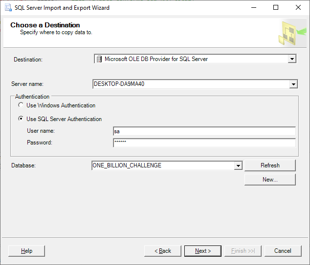
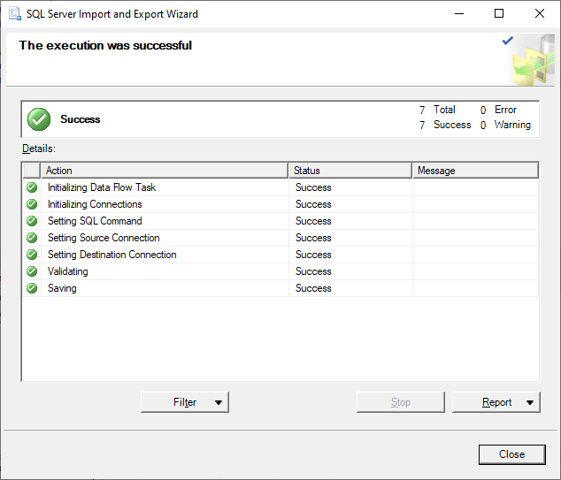
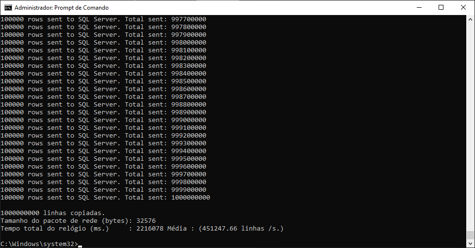

# Carregando e calculando 1 bilhão de linhas no SQL Server

Inspirado no desafio conhecido como "The One Billion Row Challenge". Meu propósito desse projeto é mostrar, de forma prática, como é possível carregar uma quantidade grande de dados (1 bilhão de linhas) no SQL Server, com segurança e foco em performance.

A ideia aqui é explorar e testar diferentes estratégias de carga e depois mostrar como o banco se comporta ao fazer consultas e cálculos pesados sobre esses dados. Tudo isso com uma visão voltada para o uso real em ambientes de produção, sempre buscando boas práticas.

## Objetivos
- Testar diferentes métodos de importação de dados.
- Realizar medições de desempenho.
- Apresentar boas práticas para lidar com grande carga de dados.


## Tecnologias utilizadas nesse projeto
- Microsoft SQL Server 2022 - Developer Edition (64-bit)
- SQL Server Management Studio (SSMS) - 20.2.37.0
- Sistema Operacional: Windows 10 Pro

## Índice

- [Criando um database para realizar os testes](#criando-um-database-para-realizar-os-testes)
- [Criando o arquivo base de 1 bilhão de linhas](#criando-o-arquivo-base-de-1-bilhão-de-linhas)
- [Usando o Assistente de Importação e Exportação (Import and Export Wizard)](#usando-o-assistente-de-importação-e-exportação-import-and-export-wizard)
  - [Usando o Import Flat File](#usando-o-import-flat-file)
  - [Usando o Import Data](#usando-o-import-data)
- [Utilizando o utilitário bcp](#utilizando-o-utilitário-bcp)
- [Importando utilizando o Integration Services (SSIS)](#importando-utilizando-o-integration-services-ssis)

## Criando um database para realizar os testes

Criado database ONE_BILLION_CHALLENGE:

```
CREATE DATABASE ONE_BILLION_CHALLENGE;
GO
```

## Criando o arquivo base de 1 bilhão de linhas

Para gerar o arquivo de dados que será usado nos testes, utilizei o repositório original do desafio. Você pode acessar o projeto [clicando aqui](https://github.com/gunnarmorling/1brc).

Basta seguir os passos do repositorio. O projeto é feito em Java, então é necessário ter o Java instalado na sua máquina para conseguir executar os passos.

O processo irá gerar um arquivo em formato .txt com aproximadamente 12 GB, e pode levar cerca de 10 minutos (esse foi o tempo gasto no meu ambiente).

Exemplo do dados do arquivo gerado:

```
Mogadishu;22.9
La Paz;6.4
New Orleans;20.6
Fairbanks;-11.0
Boston;1.5
Kuopio;1.4
Belize City;39.4
Tampa;31.9
San Diego;20.0
Saint Petersburg;-5.2
```

"*Mogadishu*" seria o nome de uma estação e "*22.9*" sua temperatura.

## Usando o Assistente de Importação e Exportação (Import and Export Wizard)


Existem dois tipos de importação de usando o assistente do SSMS, ***Import Flat File*** e ***Import Data***.

### Usando o Import Flat File

Seria a maneira mais simples e direta de realizar a importação de um arquivo simples no formato ``.csv`` ou ``.txt``.

O processo é basicamente:

Selecionar o arquivo a ser importado → definir o nome da tabela → configurar o schema → concluir.


Porém, ao tentar utilizar esse assistente com o arquivo gerado (com cerca de 12 GB), recebi a seguinte mensagem de erro:


Provavelmente, o tamanho do arquivo é tão grande que o assistente não consegue alocar tudo na memória e isso acaba causando a falha na importação.

Esse assistente é bastante prático para arquivos pequenos ou médios. No entanto, para volumes maiores (como no caso desse projeto), ele não é recomendado.

### Usando o Import Data

O Import Data é um assistente de importação mais robusto, permitindo a escolha entre diversos tipos de fontes de dados.

Foi escolhido o formato *Flat File Source* como fonte de dados.


Ele oferece mais controle sobre o processo, como:

- Definir o delimitador do arquivo (vírgula, ponto e vírgula, etc.).
- Renomear nomes das colunas e os tipos da tabela de destino.
- Visualizar um preview de como os dados ficarão após a importação.

O destino dos dados será no nosso database ONE_BILLION_CHALLENGE.



Podemos ter o preview de como pode ficar a tabela após a importação:


Podemos executar a importação diretamente e/ou salvar um pacote SSIS para reaproveitar ou automatizar esse processo no futuro.


É possível realizar a importação diretamente, mas irei utilizar a opção de salvar o arquivo SSIS Package para poder fazer as métricas de duração da importação.


Basta finalizar para que o arquivo seja criado.



Para executar o pacote SSIS, vamos utilizar o utilitário [dtexec](https://learn.microsoft.com/pt-br/sql/integration-services/packages/dtexec-utility?view=sql-server-ver16).

Utilizei o comando abaixo:

```
dtexec /F "C:\import-1billion-rows.dtsx" /REP V | Tee-Object -FilePath log.txt
```

- *dtexec*: Executa o pacote SSIS a partir da linha de comando.
- */F*: Informa que você está executando um pacote salvo como um arquivo .dtsx.
- */REP*: Define o nível de log/reporting que será gerado.
- *V (Verbose)*: Especifica que o log deve ser o mais detalhado possível, incluindo todos os eventos, mensagens de erro, progresso, avisos e tempo de execução.
- *Tee-Object*: Este comando do PowerShell permite que você exiba a saída de um comando ao mesmo tempo em que a salva em um arquivo.
- *-FilePath log.txt:* Define o caminho e o nome do arquivo onde a saída será salva. O log será gravado no arquivo log.txt.

No final do processo será mostrado uma mensagem parecida com essa:

```
DTExec: a execução do pacote retornou DTSER_SUCCESS (0).
Início: 15:04:12
Conclusão: 15:50:36
Tempo decorrido:  2784.19 segundos
```

Foi preciso um pouco mais de **46 minutos** para importar todas as linhas.

Essa ferramenta é mais adequada para arquivos grandes, embora ainda não seja a opção mais performática quando lidamos com bilhões de linhas. Mesmo assim, é útil para testes, análises exploratórias ou importações estruturadas.

## Utilizando o utilitário bcp

BCP (Bulk Copy Program) é uma ferramenta de linha de comando do SQL Server usada para importar ou exportar grandes volumes de dados de forma rápida entre arquivos e tabelas.

Pontos para o uso do BCP:

- Alta performance: Trabalha com grandes volumes de dados rapidamente.
- Leve e direto: Utilitário simples, sem necessidade de interface gráfica.
- Personalizável: Permite definir delimitadores, codificações, tamanho de lotes, arquivos de erro etc.

Para mais informações sobre o bcp, [clique aqui](https://learn.microsoft.com/pt-br/sql/relational-databases/import-export/import-and-export-bulk-data-by-using-the-bcp-utility-sql-server?view=sql-server-ver16).

Antes de carregar usando o bcp, precisamos criar uma tabela para onde será importado os dados:

```
USE ONE_BILLION_CHALLENGE;
GO

CREATE TABLE measurements_bcp
(
	station_name VARCHAR(100),
	temperature DECIMAL(9,2)
);
GO
```

Após alguns testes, esse foi o comando utilizado em meu ambiente:

```
bcp ONE_BILLION_CHALLENGE.dbo.measurements_bcp IN "C:\measurements.txt" ^
-S DESKTOP-DA9MA40 -U <seu-usuario> -P <sua-senha> ^
-C 65001 -c -t ";" -r "0x0a" -b 100000 ^
-e "C:\bcp_errors.txt" -a 65535 -m 1000 ^
```

- ``bcp``: chama a ferramenta Bulk Copy Program.
- ``ONE_BILLION_CHALLENGE.dbo.measurements_bcp``: nome do database e tabela de destino.
- ``IN``: indica que os dados estão sendo importados para o SQL Server.
- ``"C:\measurements.txt"``: caminho completo do arquivo com os dados.
- ``-S DESKTOP-DA9MA40``: nome do servidor ou instância do SQL Server, por exemplo o nome do meu host.
- ``-U <seu-usuario>``: usuário SQL Server (modo de autenticação SQL).
- ``-P <sua-senha>``: senha do usuário.
- ``-C 65001``: define o uso da codificação UTF-8.
- ``-c``: formato de texto (caractere), não usa tipos fixos binários.
- ``-t ";"``: delimitador de colunas é ponto e vírgula (;).
- ``-r "0x0a"``: delimitador de linhas é 0x0a (newline = \n).
- ``-b 100000``: lote de 100.000 linhas por commit (melhora o desempenho).
- ``-e "C:\bcp_errors.txt"``: salva as linhas com erro nesse arquivo.
- ``-a 65535``: tamanho do buffer de pacote em bytes (ajusta desempenho).
- ``-m 1000``: permite até 1000 erros antes de interromper o processo.

Para executar, basta abrir o seu CMD e executar o comando.



O resultado nos mostra que precisou de aproximadamente **37 minutos** para a carga total dos dados, com uma taxa média de 451.247 linhas por segundo!

## Importando utilizando o Integration Services (SSIS)

SQL Server Integration Services (SSIS) é uma ferramenta da Microsoft para extração, transformação e carga de dados (ETL). Permite importar diversos tipos de arquivos e fonte de dados para tabelas SQL Server com validação, transformação e automação.

Pontos para o uso do SSIS:
- Interface gráfica: criação e visualização do fluxo ETL mais fácil.
- Alta performance: Projetado para grandes volumes de dados.
- ETL: Ferramenta com transformações nativas, sem necessidade de criação de código.
- Conectividade: Pode se conectar facilmente com outros bancos como Oracle e Mysql.

Caso não tenha instalado, é necessario possuir a extensão [SQL Server Data Tools](https://learn.microsoft.com/en-us/sql/ssdt/download-sql-server-data-tools-ssdt?view=sql-server-ver16&tabs=vs2022).

Não irei entrar em detalhes como realizei a criação do fluxo de importação, apenas criei um projeto de *Integration Services Projects*, com um fluxo simples de input de arquivo TXT para um destino OLE DB.

Criando o projeto:


Realizando o fluxo de processo:


Resultado do processo:


A importação usando o SSIS durou quase exatamente **55 minutos**.

Apesar de ter demorado mais tempo que os testes anteriores, o SSIS é uma ótima ferramenta para ETL utilizado em ambiente profissionais. Pela seu poder de controle maior no fluxo de processo, possuir transformações embutidas, monitoramento e logging dos trabalhos e de ser reutilizado em automações.